# Lab 11 - Implement Monitoring


## Índice

- [Descripción del laboratorio](#descripción-del-laboratorio)
- [Escenario del laboratorio](#escenario-del-laboratorio)
- [Esquema Visual del Laboratorio](#esquema-visual-del-laboratorio)
- [Habilidades adquiridas](#habilidades-adquiridas)
- [Costo Total del Laboratorio](#costo-total-del-laboratorio)
- [Desarrollo del laboratorio](#desarrollo-del-laboratorio)
  - [Tarea 1: Provisionar infraestructura con plantilla](#tarea-1-provisionar-infraestructura-con-plantilla)
  - [Tarea 2: Crear una alerta](#tarea-2-crear-una-alerta)
  - [Tarea 3: Configurar notificaciones en Action Group](#tarea-3-configurar-notificaciones-en-action-group)
  - [Tarea 4: Disparar y validar la alerta](#tarea-4-disparar-y-validar-la-alerta)
  - [Tarea 5: Configurar regla de procesamiento de alertas](#tarea-5-configurar-regla-de-procesamiento-de-alertas)
  - [Tarea 6: Consultas en Azure Monitor Logs](#tarea-6-consultas-en-azure-monitor-logs)
- [Conceptos reforzados](#conceptos-reforzados)
- [Resultados esperados](#resultados-esperados)
- [Limpieza de recursos](#limpieza-de-recursos)
- [Contribuciones](#contribuciones)
- [Licencia](#licencia)

---

## Descripción del laboratorio

En este laboratorio exploraremos de manera práctica las capacidades de **Azure Monitor**, la solución nativa de Microsoft Azure para supervisar y analizar el estado de los recursos en la nube. A través de una serie de tareas, aprenderemos a configurar alertas, definir grupos de acción, aplicar reglas de procesamiento y ejecutar consultas en **Log Analytics**, con el fin de construir un sistema de monitoreo integral.  

El propósito es que los administradores de la infraestructura puedan recibir notificaciones inmediatas ante cambios significativos, como la eliminación de una máquina virtual o variaciones en su rendimiento. De esta forma se garantiza una **mayor visibilidad** sobre lo que ocurre en el entorno y se habilita una **respuesta rápida** frente a incidentes o eventos inesperados.  

Durante el desarrollo del laboratorio:  

- Provisionaremos una máquina virtual que servirá como recurso de prueba para los escenarios de monitoreo.  
- Crearemos alertas que detecten eventos críticos y las vincularemos a **Action Groups**, asegurando que el equipo de operaciones reciba notificaciones por correo electrónico.  
- Implementaremos **reglas de procesamiento de alertas** para gestionar períodos de mantenimiento, evitando notificaciones innecesarias y reduciendo el ruido operativo.  
- Ejecutaremos consultas en **Log Analytics** utilizando **KQL (Kusto Query Language)**, lo que nos permitirá analizar métricas y registros en tiempo real y obtener información detallada sobre el comportamiento de la infraestructura.  

Este laboratorio no solo refuerza conocimientos técnicos sobre la configuración de herramientas de monitoreo, sino que también introduce buenas prácticas de **gobernanza y operación en la nube**, esenciales para mantener la estabilidad, seguridad y eficiencia de los servicios desplegados en Azure.

⏱ **Duración estimada:** 40 minutos  
🌍 **Región utilizada en las instrucciones:** East US  

---

## Escenario del laboratorio

La organización ha completado la migración de su infraestructura hacia **Microsoft Azure**, lo que implica que ahora la operación y administración de sus recursos depende directamente de la nube. En este nuevo entorno, resulta fundamental contar con mecanismos de **monitoreo proactivo** que permitan detectar cambios críticos y notificar oportunamente a los administradores.  

El objetivo principal es garantizar la **continuidad operativa** y la **seguridad de los servicios**, evitando que modificaciones no planificadas —como la eliminación de una máquina virtual o la degradación de su rendimiento— pasen desapercibidas. Para lograrlo, se implementa un sistema de monitoreo basado en **Azure Monitor** y **Log Analytics**, que ofrece capacidades de recopilación de métricas, generación de alertas y análisis de registros.  

Durante el laboratorio, configuraremos:  

- **Alertas** que se activan ante eventos relevantes (por ejemplo, la eliminación de una VM).  
- **Action Groups** que permiten enviar notificaciones inmediatas al equipo de operaciones mediante correo electrónico u otros canales.  
- **Reglas de procesamiento de alertas** que ayudan a suprimir o modificar notificaciones durante períodos de mantenimiento programado, evitando ruido innecesario.  
- **Consultas en Log Analytics** que nos permiten analizar datos históricos y en tiempo real, utilizando el lenguaje KQL para obtener información detallada sobre el estado de los recursos.  

Este escenario refleja una situación real en la que los administradores deben estar preparados para responder rápidamente a incidentes, asegurando que la infraestructura en la nube se mantenga estable, segura y con costos controlados. El laboratorio nos guía paso a paso en la construcción de este sistema de monitoreo, reforzando buenas prácticas de gobernanza y operación en Azure.

---

## Esquema Visual del Laboratorio

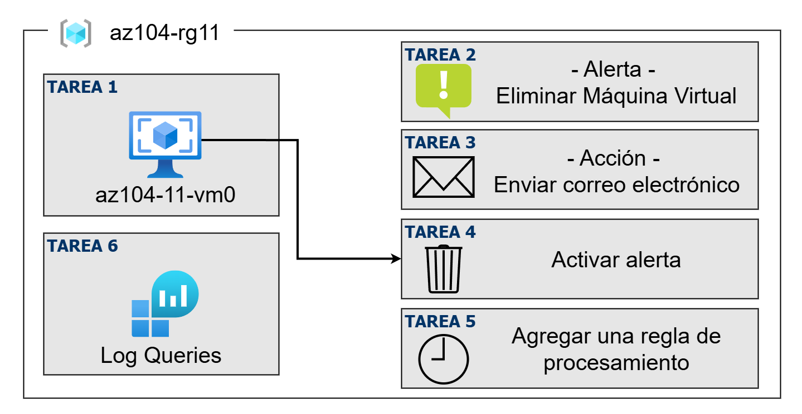

- Tarea 1: Usar una plantilla para aprovisionar una infraestructura.
- Tarea 2: Crear una alerta.
- Tarea 3: Configurar notificaciones en un grupo de acción.
- Tarea 4: Disparar una alerta y confirmar que funciona.
- Tarea 5: Configurar una regla de procesamiento de alertas.
- Tarea 6: Usar consultas de registros en Azure Monitor

---

## Habilidades adquiridas

- Implementación de **Azure Monitor** para máquinas virtuales.
- Creación y configuración de **alertas** en Azure.
- Configuración de **Action Groups** para notificaciones.
- Uso de **reglas de procesamiento de alertas** para mantenimiento.
- Ejecución de **consultas en Log Analytics** con KQL.
- Integración de monitoreo con infraestructura provisionada mediante plantillas ARM.

---

## Costo Total del Laboratorio

Para este laboratorio se despliega una máquina virtual y se configuran servicios de monitoreo con **Azure Monitor** y **Log Analytics**. El cálculo se realiza considerando una duración de **1 hora** de ejecución.

### Recursos principales

| Recurso                         | Detalle                                    | Costo aproximado (1 hora) |
|---------------------------------|--------------------------------------------|---------------------------|
| Máquina Virtual (VM)            | Standard_D2s_v3 (2 vCPU, 8 GiB RAM)        | $0.096 USD                |
| Disco OS (Premium SSD 128 GiB)  | Almacenamiento asociado a la VM            | $0.026 USD                |
| Red (VNet, NIC, IP pública)     | Incluido sin costo adicional significativo | $0.00 USD                 |
| Log Analytics                   | Ingesta de datos (10 GB/mes, 5 GB gratis)  | $0.015 USD                |
| Alertas                         | 2 reglas activas (metric + log)            | $0.01 USD                 |

### Total estimado por 1 hora de laboratorio

**≈ $0.15 USD**

---

### 📌 Consideraciones

- El costo real depende del tiempo que mantengamos la VM encendida y del volumen de datos ingeridos en **Log Analytics**.  
- Para un laboratorio corto, como lo es este caso, 1 hora, el costo es mínimo, pero si la VM se deja encendida más tiempo, el gasto mensual puede superar fácilmente los **$100 USD**.
- Los **correos electrónicos de notificación** en los *Action Groups* no generan costo adicional, aunque SMS o llamadas de voz pueden tener cargos según el proveedor.
- Es recomendable **eliminar el resource group al finalizar** para evitar cargos innecesarios.

---

## Desarrollo del laboratorio

### Tarea 1: Provisionar infraestructura con plantilla

En esta tarea desplegaremos una máquina virtual que utilizaremos para probar escenarios de monitoreo.

1. Descarguemos los archivos del laboratorio `\Allfiles\Labs\11\az104-11-vm-template.json` en nuestro equipo que se encuentran ubicados en el [Sitio de lab oficial](https://github.com/MicrosoftLearning/AZ-104-MicrosoftAzureAdministrator/archive/master.zip) ó también en este mismo repositorio.


2. Iniciemos sesión en el portal de Azure: [https://portal.azure.com](https://portal.azure.com).  
3. Desde el portal de Azure, busquemos y seleccionemos **Deploy a custom template**.


4. En la página de implementación personalizada, seleccionemos **Build your own template in the editor**.
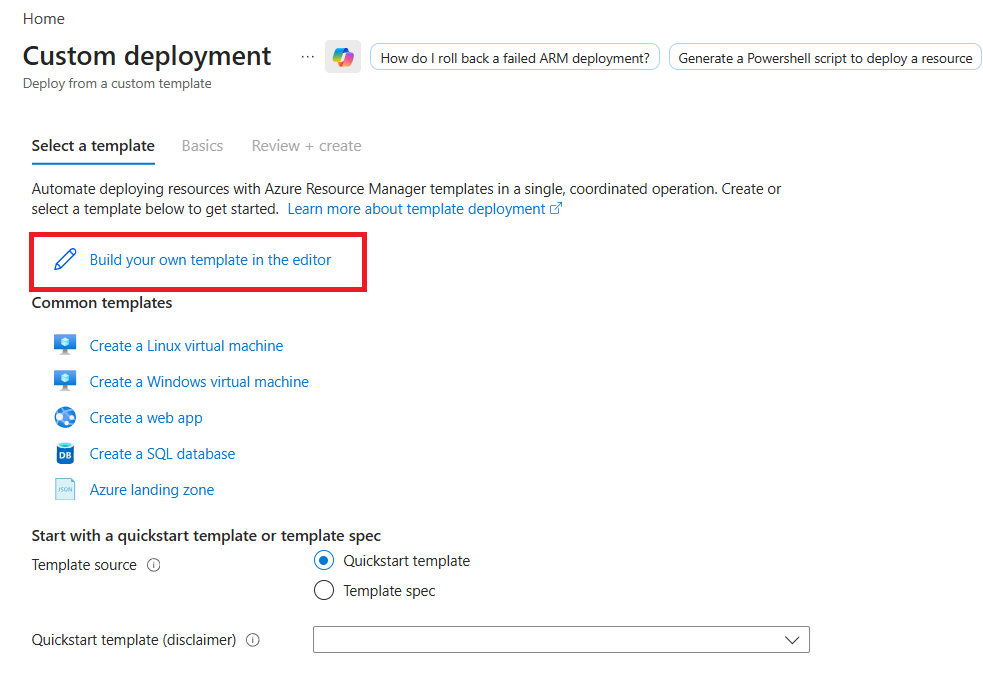

5. En la página de edición de la plantilla, seleccionemos **Load file**.
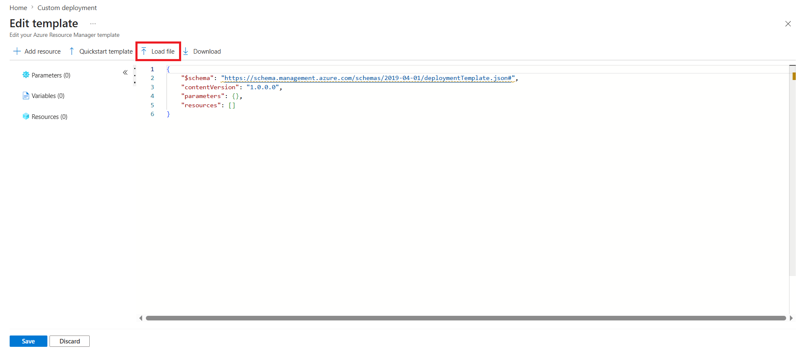

6. Localicemos y seleccionemos el archivo `\Allfiles\Labs\11\az104-11-vm-template.json` y luego hagamos clic en **Open**.  
7. Seleccionemos **Save**.  

Utilicemos la siguiente información para completar los campos de la implementación personalizada, dejando todos los demás valores por defecto:

| Configuración       | Valor |
|----------------|-------|
| Subscription   | Nuestra suscripción de Azure |
| Resource group | az104-rg11 (Si es necesario, seleccionar *Create new*) |
| Region         | East US |
| Username       | localadmin |
| Password       | Ingresar una contraseña compleja |


1. Seleccionemos **Review + create**, luego **Create**.

2. Esperemos a que finalice la implementación y hagamos clic en **Go to resource group**.

3. Revisemos qué recursos fueron desplegados. Debe existir una red virtual con una máquina virtual.  
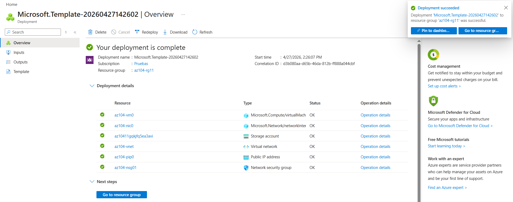
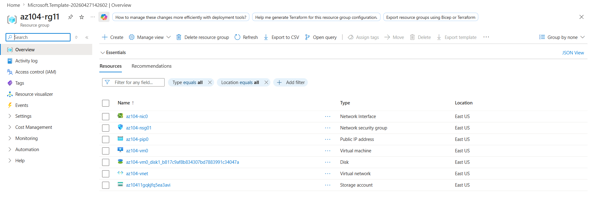

---

#### Configurar Azure Monitor para máquinas virtuales (esto se usará en la última tarea)

1. En el portal, busquemos y seleccionemos **Monitor**.
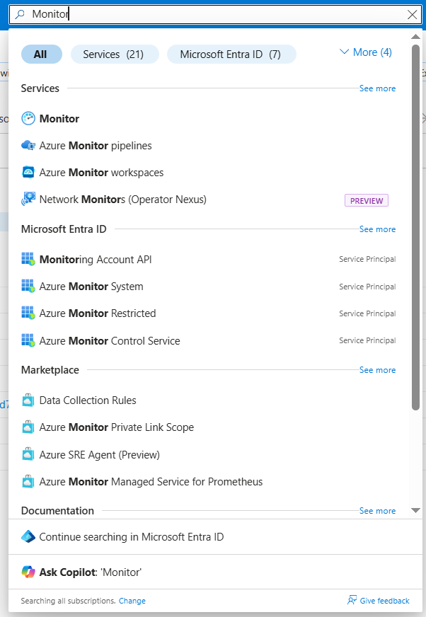

2. Tomemos un momento para revisar todas las herramientas de información, detección, triaje y diagnóstico disponibles.

3. Seleccionemos **View** en el recuadro de *VM Insights* y luego **Configure Insights**.


4. Seleccionemos **Enable** junto a nuestra máquina virtual.
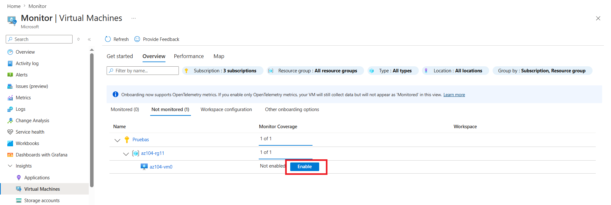

5. Aceptemos los valores predeterminados, seleccionemos **Review + enable**, y luego **Enable**.

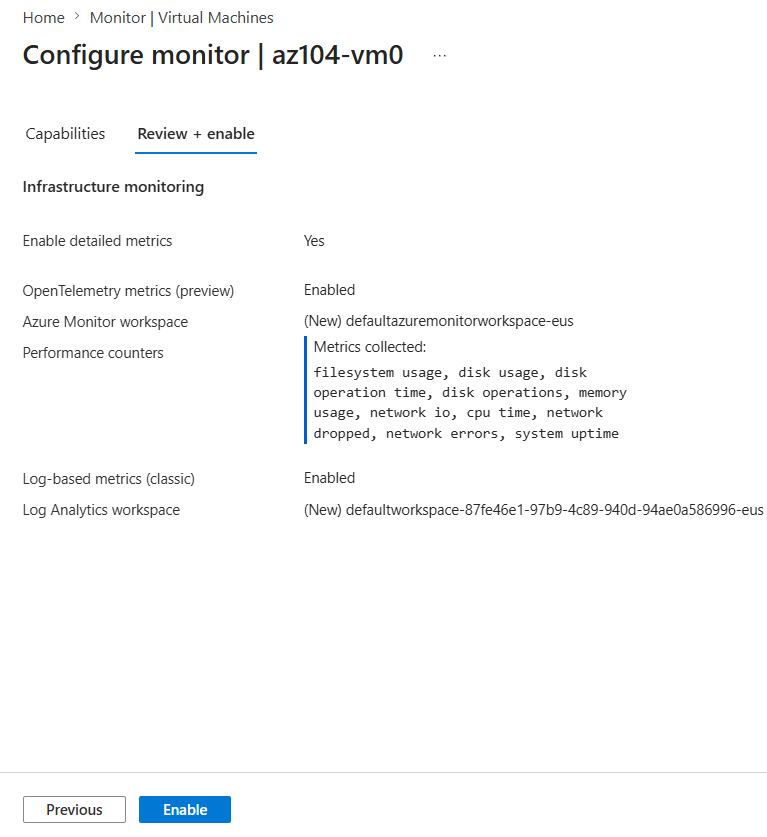

> Nota: La instalación y configuración del agente de la máquina virtual puede tardar algunos minutos. Una vez completado, continuamos con el siguiente paso.

---

### Tarea 2: Crear una alerta

En esta tarea configuraremos una alerta que se active cuando una máquina virtual sea eliminada.

1. Continuemos en la página de **Monitor** y seleccionemos **Alerts**.


2. Seleccionemos **Create +** y luego **Alert rule**.
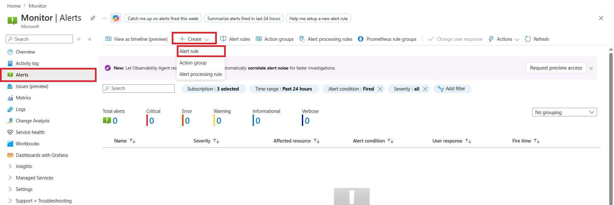

3. Marquemos la casilla de la suscripción y luego seleccionemos **Apply**.


   - Esta alerta se aplicará a cualquier máquina virtual dentro de la suscripción.  
   - Alternativamente, podríamos especificar una máquina en particular.  
4. En la pestaña **Condition**, seleccionemos el enlace **See all signals**.
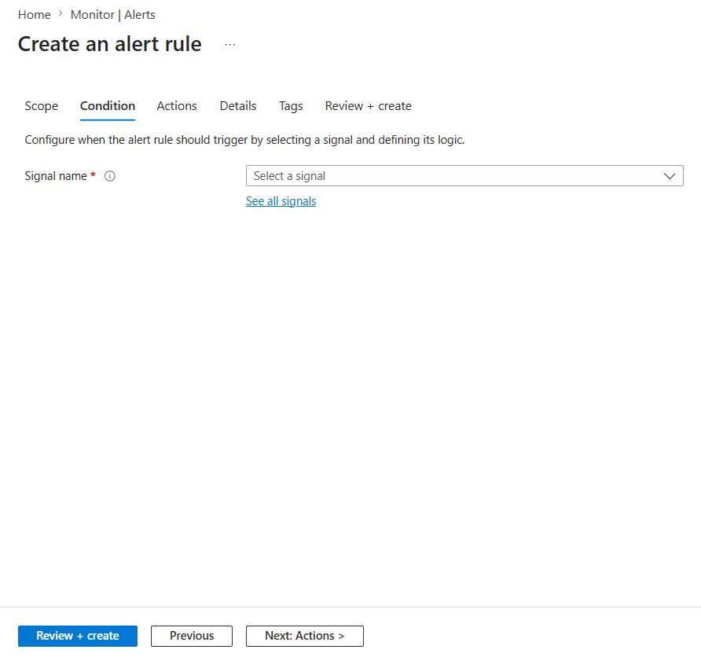

5. Busquemos y seleccionemos **Delete Virtual Machine (Virtual Machines)**.
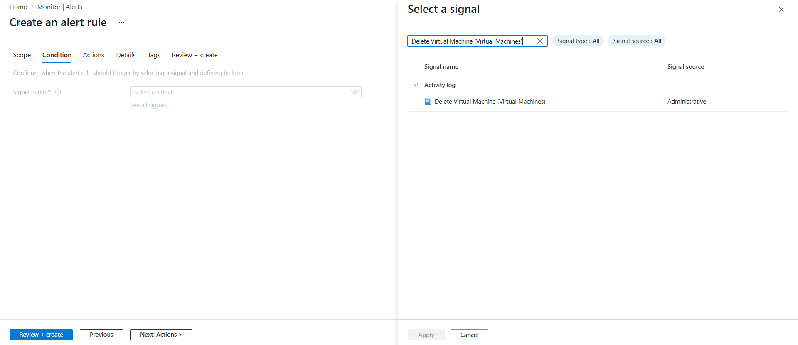

   - Observemos las demás señales integradas disponibles.  
   - Seleccionemos **Apply**.  
6. En el área de **Alert logic** (desplazándonos hacia abajo), revisemos las selecciones de **Event level**.  
   - Dejemos el valor predeterminado de **All selected**.
    

7. Revisemos las selecciones de **Status**.  
   - Dejemos también el valor predeterminado de **All selected**.  
8. Mantengamos abierta la ventana de creación de la regla de alerta para la siguiente tarea.

---

### Tarea 3: Configurar notificaciones en Action Group

En esta tarea configuraremos que, si la alerta se activa, se envíe una notificación por correo electrónico al equipo de operaciones.

1. Continuemos trabajando en nuestra alerta. Movámonos a la pestaña **Actions**, seleccionemos **Use action groups** y luego **Create action group** en el panel **Select action group**.


> 💡 Sabías que: podemos agregar hasta cinco *action groups* a una regla de alerta. Los *action groups* se ejecutan de manera concurrente, sin un orden específico. Varias reglas de alerta pueden usar el mismo *action group*.  

---

#### Configuración en la pestaña **Basics**

Ingresamos los siguientes valores:

| Configuración           | Valor |
|-------------------|-------|
| Subscription      | Nuestra suscripción |
| Resource group    | az104-rg11 |
| Region            | Global |
| Action group name | Alert the operations team (Debe ser único en el grupo de receursos) |
| Display name      | AlertOpsTeam |

---

#### Configuración en la pestaña **Notifications**

1. Seleccionemos **Next: Notifications**.  
2. Ingresamos los siguientes valores:  

| Configuración           | Valor |
|--------------------|-------|
| Notification type  | Seleccionar Email/SMS message/Push/Voice |
| Name               | VM was deleted |

1. Seleccionemos **Email**, y en el cuadro **Email** ingresamos nuestra dirección de correo electrónico.
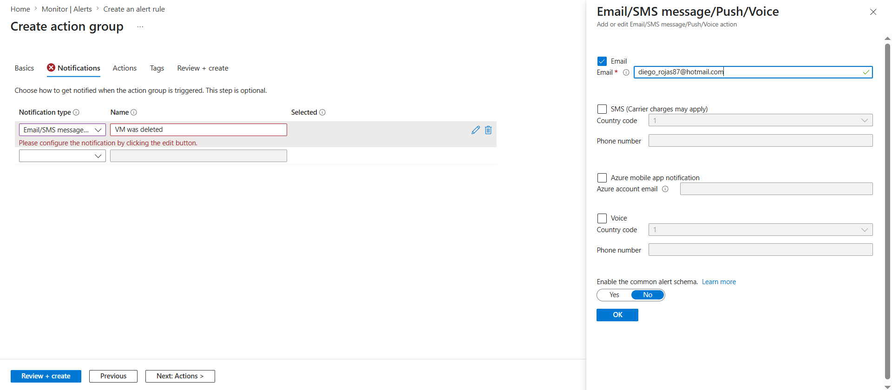

2. Seleccionemos **OK**.

> Nota: Deberíamos recibir un correo electrónico indicando que fuimos agregados a un *action group*. Puede haber un pequeño retraso, pero es señal de que la regla se ha desplegado correctamente.


---

#### Finalizar creación del Action Group

1. Seleccionemos **Review + create** y luego **Create**.
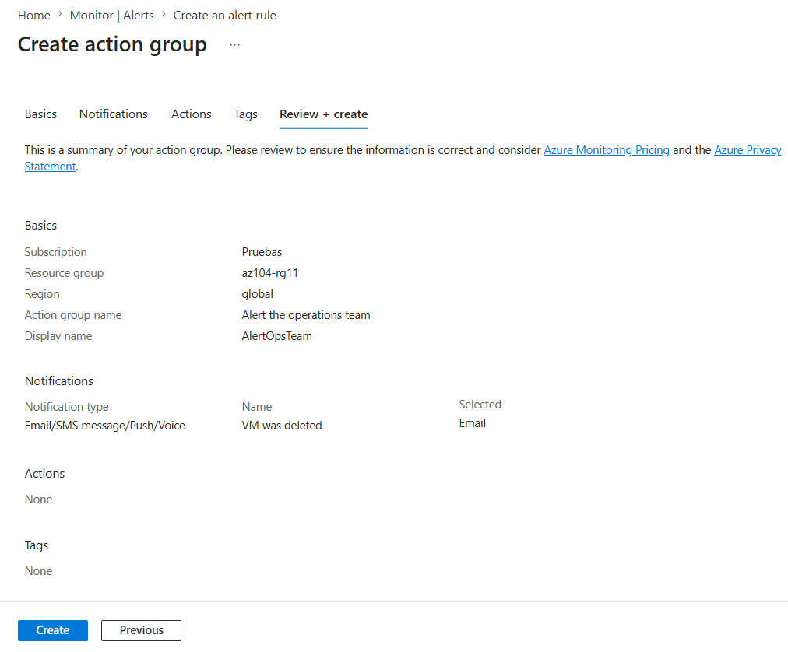

2. Una vez creado el *action group*, avancemos a la pestaña **Next: Details >** e ingresemos los siguientes valores:  

| Setting             | Value |
|---------------------|-------|
| Alert rule name     | VM was deleted |
| Alert rule description | A VM in your resource group was deleted |


1. Seleccionemos **Review + create** para validar la configuración y luego **Create**.


---

### Tarea 4: Disparar y validar la alerta

En esta tarea dispararemos la alerta y confirmaremos que se envía una notificación.

> Nota: Si eliminamos la máquina virtual antes de que la regla de alerta se haya desplegado, la alerta podría no activarse.

1. En el portal, busquemos y seleccionemos **Virtual machines**.


2. Marquemos la casilla de la máquina virtual **az104-vm0**.
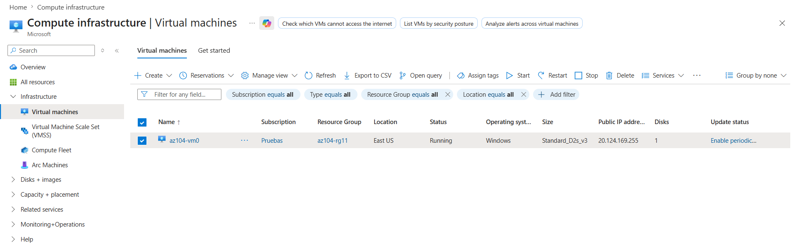

3. En la barra de menú, seleccionemos **Delete**.
4. Marquemos la casilla **Apply force delete**.  
5. Marquemos la casilla inferior confirmando que queremos eliminar los recursos y luego seleccionemos **Delete**.


6. En la barra de título, seleccionemos el ícono **Notifications** y esperemos hasta que **vm0** se elimine correctamente.


> Deberíamos recibir un correo electrónico de notificación con el asunto: *Important notice: Azure Monitor alert VM was deleted was activated…*.  
> Si no lo recibimos de inmediato, revisemos nuestro programa de correo y busquemos un mensaje de **<azure-noreply@microsoft.com>**.


1. En el menú de recursos del portal de Azure, seleccionemos **Monitor**, y luego **Alerts** en el menú de la izquierda.  
2. Verificaremos que se generaron tres alertas detalladas al eliminar **vm0**.


> Nota: El envío del correo de alerta y la actualización de las alertas en el portal puede tardar algunos minutos. Si no queremos esperar, podemos continuar con la siguiente tarea y luego volver a revisar.  

1. Seleccionemos el nombre de una de las alertas (por ejemplo, **VM was deleted**).  
   - Se abrirá un panel de **Alert details** que mostrará más información sobre el evento.
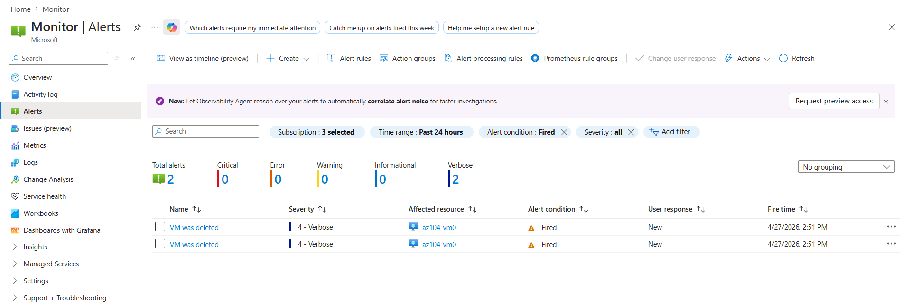
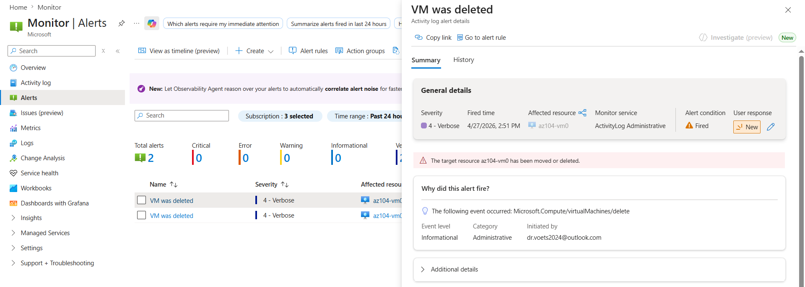

---

### Tarea 5: Configurar regla de procesamiento de alertas

En esta tarea crearemos una regla de alerta para suprimir notificaciones durante un período de mantenimiento.

1. Continuemos en el panel **Alerts**, seleccionemos **Alert processing rules** y luego **+ Create**.
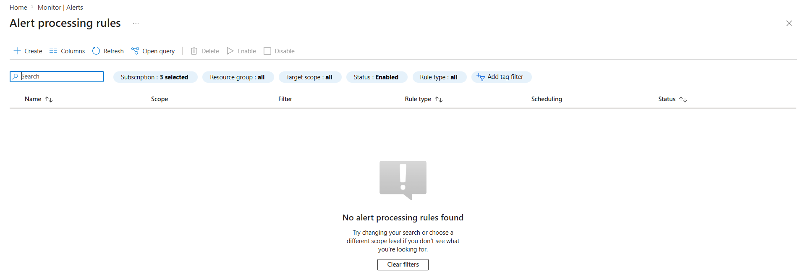

2. Seleccionemos nuestra **Subscription**, luego hagamos clic en **Apply**.


3. Seleccionemos **Next: Rule settings**, y luego **Suppress notifications**.  
4. Seleccionemos **Next: Scheduling >**.

> Por defecto, la regla funciona todo el tiempo, a menos que la deshabilitemos o configuremos un horario. Vamos a definir una regla para suprimir notificaciones durante el mantenimiento nocturno.

Ingresamos los siguientes valores en la sección de programación de la regla de procesamiento de alertas:

| Configuración        | Valor |
|----------------|-------|
| Apply the rule | At a specific time |
| Start          | Enter today’s date at 10 pm |
| End            | Enter tomorrow’s date at 7 am |
| Time zone      | Select the local timezone |

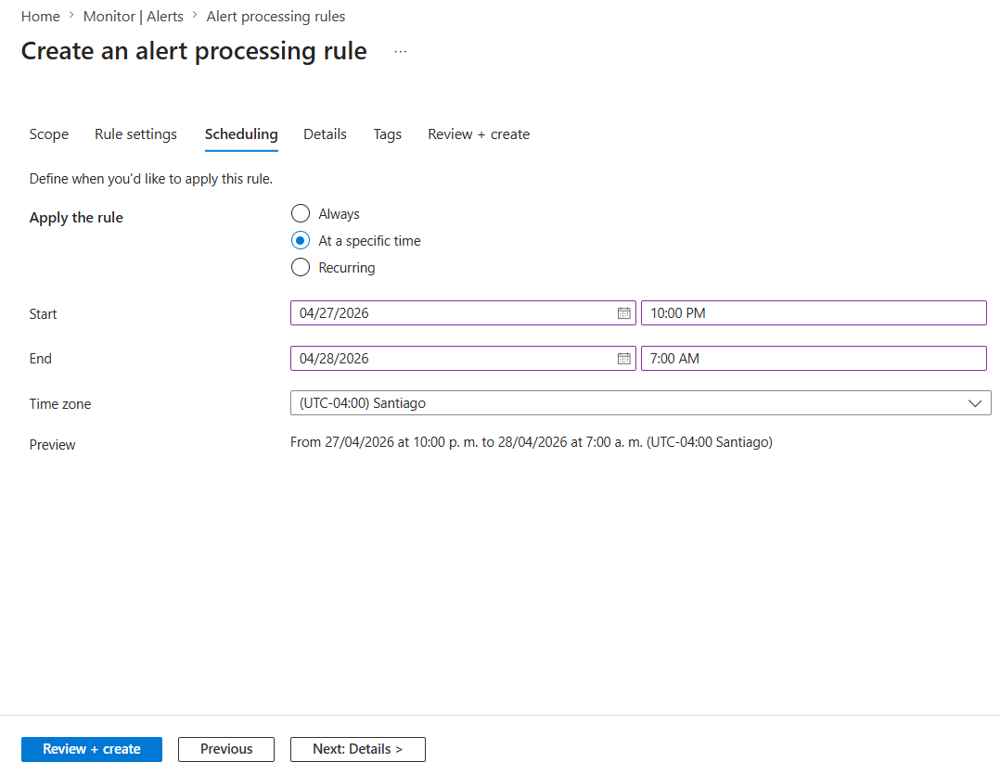

>(En el portal se mostrará la sección de programación de la regla de procesamiento de alertas.)

1. Seleccionemos **Next: Details >** e ingresemos los siguientes valores:  

| Setting        | Value |
|----------------|-------|
| Resource group | az104-rg11 |
| Rule name      | Planned Maintenance |
| Description    | Suppress notifications during planned maintenance |

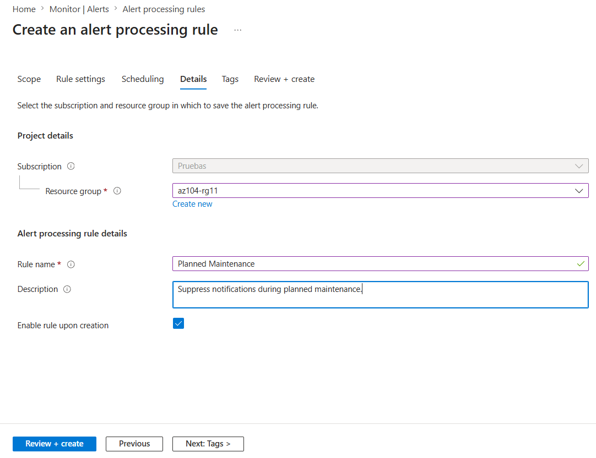

1. Seleccionemos **Review + create** para validar la configuración y luego **Create**.


---

### Tarea 6: Consultas en Azure Monitor Logs

En esta tarea utilizaremos **Azure Monitor** para consultar los datos capturados desde la máquina virtual.

> Nota: Está bien si no aparece información de inmediato. El objetivo es enfocarnos en los pasos para revisar la información de monitoreo, incluyendo consultas preconfiguradas y personalizadas.

1. En el portal de Azure, busquemos y seleccionemos **Monitor**, luego hagamos clic en **Logs**.
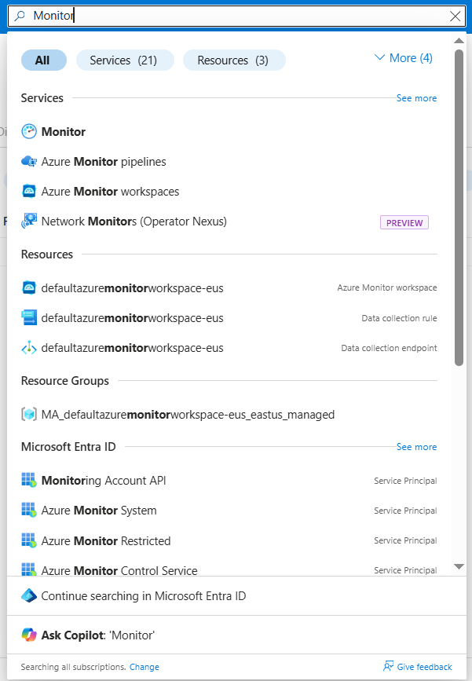

2. Si es necesario, cerremos la pantalla inicial (*splash screen*).


3. Si es necesario, seleccionemos un **scope**, nuestra **Subscription**, y luego hagamos clic en **Apply**.


4. En la pestaña **Queries**, seleccionemos **Virtual machines** (panel izquierdo).  
   - Puede que tengamos que reabrir el panel (*blade*).  

>(En el portal se mostrará la pestaña de consultas disponibles.)

5. Revisemos las consultas disponibles. Ejecutemos (pasando el cursor sobre la consulta) la consulta **Count heartbeats**.  
   - Deberíamos recibir un conteo de *heartbeats* correspondientes al tiempo en que la máquina virtual estuvo en ejecución.  
6. En el lado derecho de la pantalla, seleccionemos el menú desplegable junto a **Simple mode** y elijamos **KQL mode**.  
   - Revisemos la consulta. Esta consulta utiliza la tabla **Heartbeat**.  
7. Reemplacemos la consulta por la siguiente y luego seleccionemos **Run**. Revisemos el gráfico resultante:  

```kql
InsightsMetrics
| where TimeGenerated > ago(1h)
| where Name == "UtilizationPercentage"
| summarize avg(Val) by bin(TimeGenerated, 5m), Computer //split up by computer
| render timechart
```
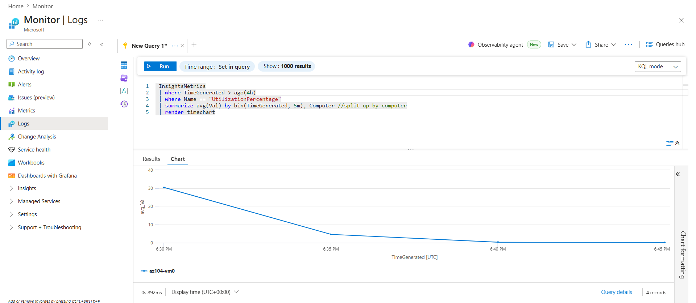

> Nota: Si la consulta no se pega correctamente, intentamos copiarla primero en **Notepad** y luego volver a pegarla en el campo de consulta.

> 💡 Sabías que:  
>
> - Existe un **Log Analytics Demo Environment** para practicar con otras consultas.  
> - Una vez que encontremos una consulta que nos guste, podemos crear una alerta directamente desde ella.  
>

---

## Conceptos reforzados

- Las **alertas** nos ayudan a detectar y abordar problemas antes de que los usuarios noten que podría existir un inconveniente con la infraestructura o la aplicación.  
- Podemos generar alertas sobre cualquier métrica o fuente de datos de registros dentro de la plataforma de datos de **Azure Monitor**.  
- Una **regla de alerta** supervisa nuestros datos y captura una señal que indica que algo está ocurriendo en el recurso especificado.  
- Una alerta se activa si se cumplen las condiciones definidas en la regla. A partir de ella se pueden disparar varias acciones (correo electrónico, SMS, notificación push, llamada de voz).  
- Los **Action Groups** incluyen a las personas o equipos que deben ser notificados cuando una alerta se activa.

---

## Resultados esperados

- Una VM desplegada y monitoreada con Azure Monitor.
- Alertas configuradas y probadas con notificaciones enviadas.
- Regla de procesamiento activa para mantenimiento.
- Ejecución exitosa de consultas en Log Analytics.

---

## Limpieza de recursos

Si estamos trabajando con nuestra propia suscripción, tomemos un momento para eliminar los recursos del laboratorio. Esto asegurará que los recursos queden liberados y que los costos se minimicen.  
La forma más sencilla de eliminar los recursos del laboratorio es borrar el **resource group**.

- En el portal de Azure, seleccionemos el **resource group**, luego seleccionemos **Delete the resource group**, ingresamos el nombre del grupo de recursos y finalmente hacemos clic en **Delete**.
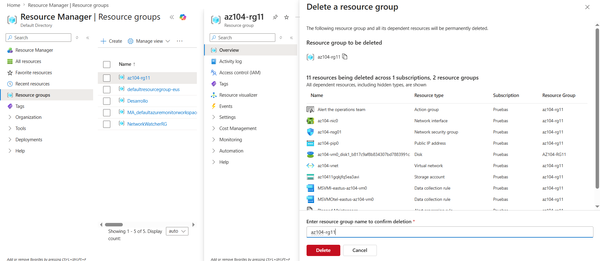

- Usando **Azure PowerShell**:

  ```powershell
  Remove-AzResourceGroup -Name resourceGroupName
  ```

- Usando la **CLI**:  

  ```bash
  az group delete --name resourceGroupName
  ```

---

## Contribuciones

Este README fue adaptado y enriquecido para fines de estudio y documentación profesional.  
Se aceptan mejoras en visualización, costos y ejemplos de consultas KQL.

---

## Licencia

Contenido educativo basado en los laboratorios oficiales de Microsoft Learning.  
Uso permitido para fines de estudio y documentación personal/profesional.
